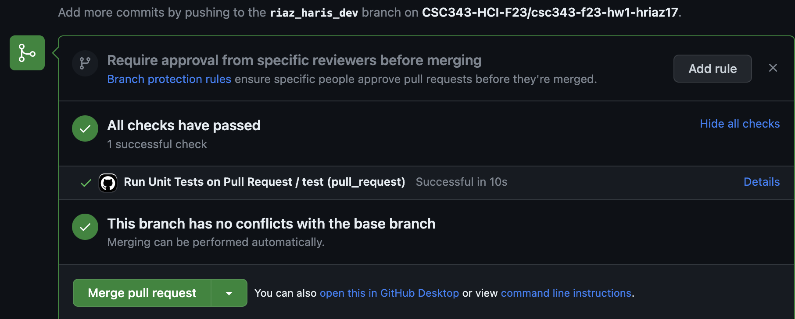

# CSC-343-HW2
A template repository for assignment 2 from CSC 343: Human Computer Interaction taught by Stephen Kobourov &amp; Haris Riaz at the University of Arizona, Fall 2023

## Prerequisites

Welcome to the repository for CSC 343 Homework 2! 

This README will guide you through setting up the project and getting the graph visualization running in your local browser.
**Make sure to read the instructions here thoroughly from start to end before writing any code**.

## Setup
1. **Creating a new branch and Cloning the Repository**:
    - First, you will need to create a new branch in your GitHub repository to hold your work.
    - Create a [branch](https://help.github.com/articles/creating-and-deleting-branches-within-your-repository/) through the GitHub interface.
    - Name your `<branch>` as `yourlastname_yourfirstname_dev` (**very important , do NOT name it anything else**)
    - Clone this repository to your local machine with a command similar to:
    - ```bash
      git clone -b <branch> https://github.com/CSC343-HCI-F23/csc343-f23-hw2-<your-username>.git
      ```
      where `<your-username>` is your GitHub username.
   
   
3. **Install dependencies**:
   
   Assuming you installed Node.js and npm correctly in Homework 1, navigate to the root of the cloned repository and run the following command to install
   the necessary Node.js dependencies.
   ```bash
   cd csc343-f23-hw2-<your-username>
   npm install
   ```
   
4. **Copy the output graph data file from Homework 1 into the root of your cloned repository**:
   
   By graph data, we refer to `output_graph.json` file that you produced at the end of Homework 1, which should contain your `nodes`, `edges` and `nodeDegree` attributes.
   It is expected to have the following format:
   ```json
   {
     "nodes": [],
     "edges": [],
     "nodeDegrees": []
   }
   ```
## Implementation
1. **Read the Graph data**:
  
   A `GraphClass.js` file is provided to which defines a minimal data structure for the graph data. You are to read the graph data from `output_graph.json`
   into this data structure.
2. **Render the Graph**
   
   Implement the main rendering functionality (and all associated functionality to support interactions with the visualization) in the file `index.js`
   which imports the `GraphClass`. A few, possibly helpful starter function definitions (with self-explanatory comment stubs) are given to you e.g.
   `loadAndRenderGraph()`, `renderGraph(graphData)` and `displayGraphStatistics(graphObj)`. Feel free to modify these functions and their arguments,
   or to use new functions.

3. **Compute Graph Statistics**:
   
   `GraphClass.js` contains some function definitions corresponding to each part of Problem 6. Implement these functions
    and render the computed statistics on the canvas of your graph visualization (**hint**: A possible approach here would be to call these functions inside the `displayGraphStatistics(graphObj)`
    method in `index.js`).

   Also, you **should not edit** these files:
    - `./tests.js`
    - `./server.js`
    - `.github/workflows/run-tests-on-pull.yml`

5. **Test your code**:
   
    Tests have been provided for you in the `./tests.js` file.
    To run all the provided tests, just type/run  ``npm test`` from command line from the root of the repository. These tests are to verify
    the correct implementation of each part of problem 6.

    If your code passes the test cases, you will see output like:
    ```
      GraphClass
      #computeAverageNodeDegree()
    ✔ should compute correct average node degree for the dummy graph data
      #computeConnectedComponents()
    ✔ should compute correct number of connected components for the dummy graph data
    ✔ #computeGraphDensity()
    ✔ should compute correct graph density for the dummy graph


    3 passing (3ms)
    ```
    
   
## Viewing the Graph Visualization in Browser

1. **Study the provided HTML file**:
  
   The project includes an HTML file `index.html`, pre-configured with some starter metadata, elements and styles,
   to assist you in displaying your graph visualization. We provide some helpful div's with `id`'s and `class` names that should be self-explanatory.
   Feel free to re-structure, and restyle this HTML file (including changing div/class names) to suit your needs. **`index.html` will be the webpage on
   which your graph is rendered**.
3. **Start the HTTP Server**:
   
   To view the interactive graph visualization, you'll need to serve the HTML file `index.html`, through an HTTP server. Run the following command to start the server:
   
   ```bash
     node server.js
   ```
   By default, the server runs on port **3000**. We provide a pre-configured `server.js` file for serving webpages. **You should not modify it**.

4. **View in Browser**:
   
   Open your web browser e.g. Chrome and navigate to: <http://localhost:3000>
   
You should now be able to see the interactive graph visualization. 


## Submitting your code

  As you are working on the code, you should regularly `git commit` to save your current changes locally and `git push` to push all saved changes to the remote repository on GitHub.    

  To submit your assignment, [create a pull request on GitHub](https://help.github.com/articles/creating-a-pull-request/#creating-the-pull-request), where the "base" branch is "master" or "main", and the "compare" branch is the branch you
  created at the beginning of this assignment.
  Then, go to the "Files changed" tab and make sure that all your changes look as you would expect them to.

  There are test cases that will be run automatically (via., [Github Actions](https://github.com/features/actions)) when a pull request is submitted. These are the same as `npm test`. 
  So if your code passed `npm test` in your machine, it’s highly likely that it will pass in GitHub. Nevertheless, you should make sure that you see a green tick mark or a message saying “All Checks Have Passed” like this:
  


   
    
